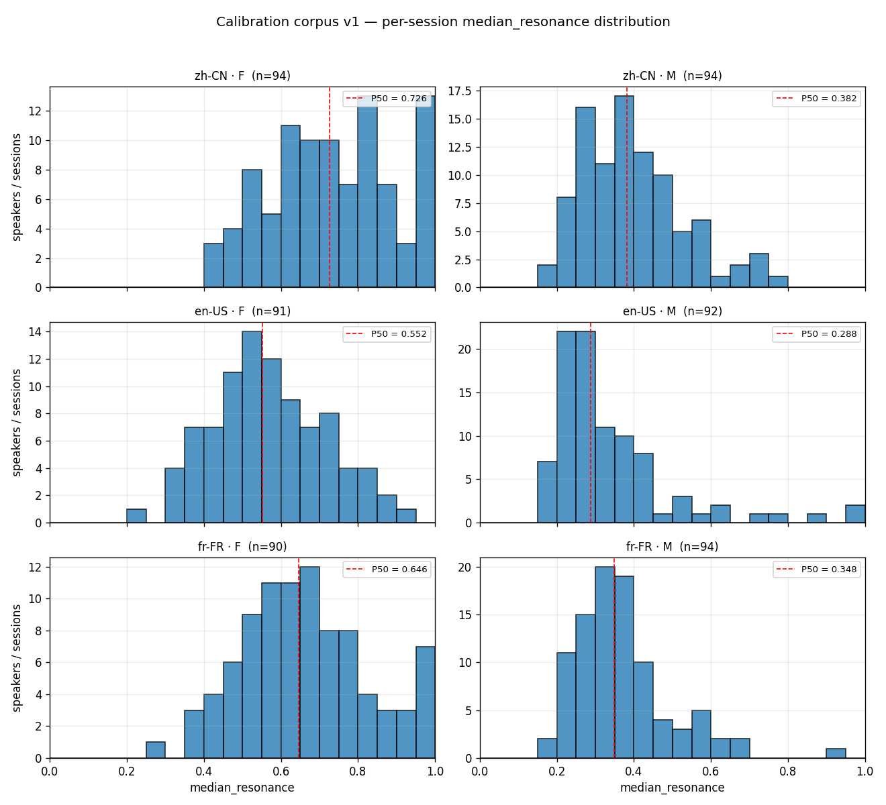

# Calibration corpus v1 — resonance%% empirical distribution

_Generated 2026-05-07T05:19:47.721644+00:00 from `/mnt/d/project_vocieduck/calibration_v1`._

## Provenance

Sources (speaker-disjoint where applicable from existing stats):

| Bucket | Source | Notes |
| --- | --- | --- |
| zh-CN F | AISHELL-3 train+test | 175 F speakers available; 1 session per spk |
| zh-CN M | AISHELL-3 train+test | 42 M speakers, multi-session (disjoint clip windows) |
| en-US F | LibriSpeech train-clean-100 | 125 F speakers; 1 session per spk |
| en-US M | LibriSpeech train-clean-100 | 126 M speakers; 1 session per spk |
| fr-FR F | Common Voice fr (validated.tsv, gender=female_feminine) | round-robin per client_id |
| fr-FR M | Common Voice fr (validated.tsv, gender=male_masculine)   | round-robin per client_id |

Mode = ``script`` (transcripts known) → no ASR error in the chain.
Engine C sidecar @ `localhost:8001`, faithful re-emission of
`summary.engine_c` via ``build_corpus._summarize_engine_c``.

## Headline (median_resonance, per-session)

| Bucket | n | P5 | P25 | P50 | P75 | P95 | mean | std | F0 P50 (Hz) |
| --- | ---:| ---:| ---:| ---:| ---:| ---:| ---:| ---:| ---:|
| en-US · F | 91 | 0.351 | 0.458 | 0.552 | 0.682 | 0.834 | 0.568 | 0.147 | 197 |
| en-US · M | 92 | 0.193 | 0.238 | 0.288 | 0.385 | 0.675 | 0.339 | 0.164 | 114 |
| fr-FR · F | 90 | 0.429 | 0.547 | 0.646 | 0.752 | 0.960 | 0.659 | 0.159 | 209 |
| fr-FR · M | 94 | 0.229 | 0.294 | 0.348 | 0.421 | 0.601 | 0.371 | 0.123 | 118 |
| zh-CN · F | 94 | 0.490 | 0.616 | 0.726 | 0.849 | 1.000 | 0.734 | 0.160 | 230 |
| zh-CN · M | 94 | 0.228 | 0.292 | 0.382 | 0.463 | 0.655 | 0.396 | 0.132 | 140 |

## Reading guide

- **Resonance% formula**: `clamp(0, 1, w_F2·z_F2 + w_F3·z_F3 + w_F4·z_F4 + 0.5)`.
  0.5 ≡ female reference distribution mean.  This is **not** the male/female
  midline — male speech routinely sits in the 0.30–0.45 range.
- **`p50` is the bucket median**.  If `zh-CN_M.p50 ≈ 0.40` and `zh-CN_F.p50 ≈ 0.68`,
  then 50% on the meter = ~midway between the two genders, *not* neutral.
- **`n_at_ceiling`** counts sessions whose median saturates at ≥ 0.98 — those
  speakers exceed the meter's headroom and the score is no longer informative
  for them; per-vowel z is the better signal.
- Per-vowel breakdowns: ``per_vowel_<lang>_<sex>.csv``.

## Use

Downstream Phase B (re-train stats) and Phase C (advice / How-to-use copy
edits) consume these CSVs.  The raw `.vga.json` bundles live in
`/mnt/d/project_vocieduck/calibration_v1` and are intentionally **not** committed (privacy: speech
carries speaker identity).  Only this report goes into git.
